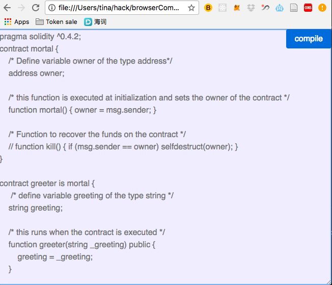

# browserCompileSolidity

## Overview
It's like a mini text editor for compiling solidity code from client side! (you can also see this as an example script to add in your project)<br>
Replace the example solidty code with yours and press the compile button:)<br><br>

[DEMO](http://rawgit.com/tina1998612/browserCompileSolidity/master/index.html) please run it in google chrome;)

## Screenshot


## Usage
```javascript
cd browserCompileSolidity
python -m SimpleHTTPServer // this will link localhost:8000 to our index.html
```
<br>
Then navigate to `localhost:8000` to start!<br>
You can open the inspecter window to check the output(compiled bytecode & abi) in the browser console
