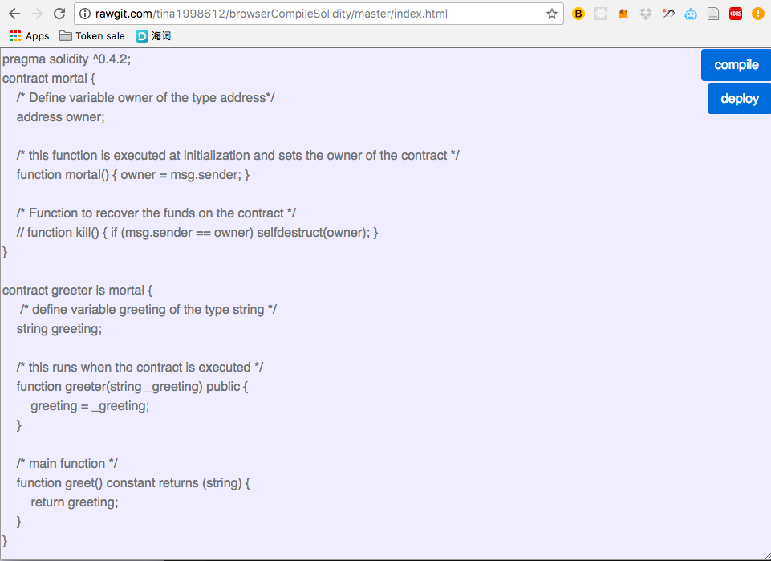

# browserCompileSolidity

## Overview
It's like a mini text editor for compiling solidity code from client side! (you can also see this as an example script to add in your project) 
Replace the example solidty code with yours and press the compile button:)  

## Usage
Simply open the index.html in your browser window 
Then open the inspecter window to check the output(compiled bytecode & abi) in browser console 
